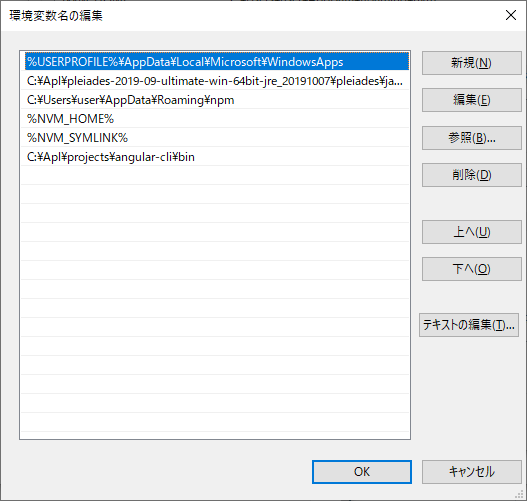

## Angular


- [](https://nodejs.org/ja/)からnodeのインストール
  →結局これ無駄だった
- [Angular QuickStart Source](https://github.com/angular/quickstart)からインストールしようとするもdeprecatedであった

### Angular CLIのインストール

- [Angular CLI](https://github.com/angular/angular-cli)からインストール
- 手順通りすすめるの下記のエラーがでる

```
C:\Apl\projects\angular-cli>yarn
yarn install v1.22.5
$ node ./tools/yarn/check-yarn.js
[1/5] Validating package.json...
error @angular/devkit-repo@11.2.0-next.0: The engine "node" is incompatible with this module. Expected version ">=10.13.0 <13.0.0". Got "14.15.4"
error Found incompatible module.
info Visit https://yarnpkg.com/en/docs/cli/install for documentation about this command.
```

- [The engine “node” is incompatible with this module.エラーの解決方法](https://hatolabo.com/programming/node-is-incompatible)
  によりnvmをインストールする！

- [nvm-windows 導入](https://qiita.com/yutakachi/items/6e9d891789b9a652c318)
- NVM_HOMEをC:\Users\user\AppData\Roaming\nvmに設定
- NVM_SYMLINKをC:\Users\user\AppData\Roaming\nodejsに設定。もとはディレクトリが存在しないが勝手に作られる

```
nvm install latest
```

```
nvm install 10.13.0
```

```
nvm use 10.13.0
```

#### nvm list

```
C:\Users\user>nvm list

    15.6.0
  * 10.13.0 (Currently using 64-bit executable)
```

- 再びチャレンジ

```
C:\Apl\projects\angular-cli>yarn
yarn install v1.22.5
$ node ./tools/yarn/check-yarn.js
[1/5] Validating package.json...
[2/5] Resolving packages...
[3/5] Fetching packages...
info fsevents@2.3.1: The platform "win32" is incompatible with this module.
info "fsevents@2.3.1" is an optional dependency and failed compatibility check. Excluding it from installation.
info @bazel/buildifier-darwin_x64@0.29.0: The platform "win32" is incompatible with this module.
info "@bazel/buildifier-darwin_x64@0.29.0" is an optional dependency and failed compatibility check. Excluding it from installation.
info @bazel/buildifier-linux_x64@0.29.0: The platform "win32" is incompatible with this module.
info "@bazel/buildifier-linux_x64@0.29.0" is an optional dependency and failed compatibility check. Excluding it from installation.
info fsevents@2.1.3: The platform "win32" is incompatible with this module.
info "fsevents@2.1.3" is an optional dependency and failed compatibility check. Excluding it from installation.
error puppeteer@5.5.0: The engine "node" is incompatible with this module. Expected version ">=10.18.1". Got "10.13.0"
error Found incompatible module.
info Visit https://yarnpkg.com/en/docs/cli/install for documentation about this command.
```

10.18.1をインストールして再実行したら成功

```
yarn build --local
```

### ここから下記は上手くいかなかったので後で削除

```
C:\Apl\projects>md example_angular
```

```
C:\Apl\projects>cd example_angular
```

```
C:\Apl\projects\example_angular>npm install -D ..\angular-cli\dist\*.tgz
npm ERR! code ENOENT
npm ERR! syscall stat
npm ERR! path C:\Apl\projects\angular-cli\dist\*.tgz
npm ERR! errno -4058
npm ERR! enoent ENOENT: no such file or directory, stat 'C:\Apl\projects\angular-cli\dist\*.tgz'
npm ERR! enoent This is related to npm not being able to find a file.
npm ERR! enoent

npm ERR! A complete log of this run can be found in:
npm ERR!     C:\Users\user\AppData\Roaming\npm-cache\_logs\2021-01-26T13_05_47_424Z-debug.log

C:\Apl\projects\example_angular>npm install -D "..\angular-cli\dist\*.tgz"
npm ERR! code ENOENT
npm ERR! syscall stat
npm ERR! path C:\Apl\projects\angular-cli\dist\*.tgz
npm ERR! errno -4058
npm ERR! enoent ENOENT: no such file or directory, stat 'C:\Apl\projects\angular-cli\dist\*.tgz'
npm ERR! enoent This is related to npm not being able to find a file.
npm ERR! enoent

npm ERR! A complete log of this run can be found in:
```

bashで実行

```
user@DESKTOP-6DQ3M4F MINGW64 /c/Apl/projects/example_angular
$ npm install -D ../angular-cli/dist/*.tgz
npm WARN deprecated urix@0.1.0: Please see https://github.com/lydell/urix#deprecated
npm WARN deprecated resolve-url@0.2.1: https://github.com/lydell/resolve-url#deprecated
npm WARN deprecated fsevents@2.1.3: "Please update to latest v2.3 or v2.2"
npm WARN deprecated chokidar@2.1.8: Chokidar 2 will break on node v14+. Upgrade to chokidar 3 with 15x less dependencies.
npm WARN deprecated fsevents@1.2.13: fsevents 1 will break on node v14+ and could be using insecure binaries. Upgrade to fsevents 2.
npm WARN deprecated request@2.88.2: request has been deprecated, see https://github.com/request/request/issues/3142
npm WARN deprecated har-validator@5.1.5: this library is no longer supported

> core-js@3.8.3 postinstall C:\Apl\projects\example_angular\node_modules\core-js
> node -e "try{require('./postinstall')}catch(e){}"

Thank you for using core-js ( https://github.com/zloirock/core-js ) for polyfilling JavaScript standard library!

The project needs your help! Please consider supporting of core-js on Open Collective or Patreon:
> https://opencollective.com/core-js
> https://www.patreon.com/zloirock

Also, the author of core-js ( https://github.com/zloirock ) is looking for a good job -)


> @angular/cli@11.1.0-next.4 postinstall C:\Apl\projects\example_angular\node_modules\@angular\cli
> node ./bin/postinstall/script.js

npm WARN saveError ENOENT: no such file or directory, open 'C:\Apl\projects\example_angular\package.json'
npm notice created a lockfile as package-lock.json. You should commit this file.
npm WARN optional SKIPPING OPTIONAL DEPENDENCY: fsevents@~2.1.2 (node_modules\rollup\node_modules\fsevents):
npm WARN notsup SKIPPING OPTIONAL DEPENDENCY: Unsupported platform for fsevents@2.1.3: wanted {"os":"darwin","arch":"any"} (current: {"os":"win32","arch":"x64"})
npm WARN optional SKIPPING OPTIONAL DEPENDENCY: fsevents@~2.3.1 (node_modules\chokidar\node_modules\fsevents):
npm WARN notsup SKIPPING OPTIONAL DEPENDENCY: Unsupported platform for fsevents@2.3.1: wanted {"os":"darwin","arch":"any"} (current: {"os":"win32","arch":"x64"})
npm WARN optional SKIPPING OPTIONAL DEPENDENCY: fsevents@^1.2.7 (node_modules\watchpack-chokidar2\node_modules\chokidar\node_modules\fsevents):
npm WARN notsup SKIPPING OPTIONAL DEPENDENCY: Unsupported platform for fsevents@1.2.13: wanted {"os":"darwin","arch":"any"} (current: {"os":"win32","arch":"x64"})
npm WARN optional SKIPPING OPTIONAL DEPENDENCY: fsevents@^1.2.7 (node_modules\webpack-dev-server\node_modules\chokidar\node_modules\fsevents):
npm WARN notsup SKIPPING OPTIONAL DEPENDENCY: Unsupported platform for fsevents@1.2.13: wanted {"os":"darwin","arch":"any"} (current: {"os":"win32","arch":"x64"})
npm WARN enoent ENOENT: no such file or directory, open 'C:\Apl\projects\example_angular\package.json'
npm WARN @angular-devkit/build-angular@0.1101.0-next.4 requires a peer of @angular/compiler-cli@^11.0.0 || ^11.1.0-next but none is installed. You must install peer dependencies yourself.
npm WARN @ngtools/webpack@11.1.0-next.4 requires a peer of @angular/compiler-cli@^11.0.0 || ^11.1.0-next but none is installed. You must install peer dependencies yourself.
npm WARN @ngtools/webpack@11.1.0-next.4 requires a peer of @angular/compiler-cli@^11.0.0 || ^11.1.0-next but none is installed. You must install peer dependencies yourself.
npm WARN example_angular No description
npm WARN example_angular No repository field.
npm WARN example_angular No README data
npm WARN example_angular No license field.

+ @angular-devkit/architect@0.1101.0-next.4
+ @angular-devkit/build-webpack@0.1101.0-next.4
+ @angular-devkit/schematics-cli@0.1101.0-next.4
+ @angular-devkit/build-optimizer@0.1101.0-next.4
+ @angular-devkit/architect-cli@0.1101.0-next.4
+ @angular/pwa@0.1101.0-next.4
+ @angular-devkit/schematics@11.1.0-next.4
+ @angular/cli@11.1.0-next.4
+ @angular-devkit/core@11.1.0-next.4
+ @angular-devkit/build-angular@0.1101.0-next.4
+ @schematics/schematics@0.1101.0-next.4
+ @schematics/update@0.1101.0-next.4
+ @ngtools/webpack@11.1.0-next.4
+ @schematics/angular@11.1.0-next.4
added 1435 packages from 571 contributors and audited 1439 packages in 177.846s

75 packages are looking for funding
  run `npm fund` for details

found 0 vulnerabilities

```


### サンプルアプリケーションの構築

[基本的なAngularアプリをはじめる](https://angular.jp/start)

- [Stackblitz](https://stackblitz.com/edit/angular-ktusoh)上で環境構築

### ローカル環境の構築

[アプリケーションのデプロイ](https://angular.jp/start/start-deployment)

- ngコマンドを打つもCommand not foudがでる

[Angular - ng: command not found](https://stackoverflow.com/questions/46623571/angular-ng-command-not-found/46623602)

- C:\Apl\projects\angular-cli\binを環境変数に追加



- コマンドプロンプトからngと打ってもエラーになる。bashから行う必要あり。

```
cd /c/tmp/
mkdir 20200131
cd 20200131
ng new my-project-name
```

```
view  C:\Users\user\AppData\Roaming\npm-cache\_logs\2021-01-31T03_27_52_357Z-debug.log
2678 error code ETARGET
2679 error notarget No matching version found for @angular/cli@~0.0.0.
2680 error notarget In most cases you or one of your dependencies are requesting
2680 error notarget a package version that doesn't exist.
2680 error notarget
2680 error notarget It was specified as a dependency of 'my-project-name'
```

[Npm Error - No matching version found for](https://stackoverflow.com/questions/44331005/npm-error-no-matching-version-found-for)

```
$ npm view ionic-native

ionic-native@2.9.0 | MIT | deps: 1 | versions: 83
Native plugin wrappers for Cordova and Ionic with TypeScript, ES6+, Promise and Observable support
https://github.com/driftyco/ionic-native

dist
.tarball: https://registry.npmjs.org/ionic-native/-/ionic-native-2.9.0.tgz
.shasum: e9a36c850eda180918407c288e5d634978e32052

dependencies:
rxjs: 5.0.1

maintainers:
- maxlynch <max@ionic.io>
- ionicjs <hi@ionicframework.com>
- ihadeed <ibby@zyra.ca>
- tlancina <tim@ionic.io>

dist-tags:
latest: 2.9.0
test: 2.2.8

published over a year ago by ihadeed <i.hadeed@zyra.ca>
```

### angular-cliがうまくインストールできていない？

```
$ ng --version

     _                      _                 ____ _     ___
    / \   _ __   __ _ _   _| | __ _ _ __     / ___| |   |_ _|
   / △ \ | '_ \ / _` | | | | |/ _` | '__|   | |   | |    | |
  / ___ \| | | | (_| | |_| | | (_| | |      | |___| |___ | |
 /_/   \_\_| |_|\__, |\__,_|_|\__,_|_|       \____|_____|___|
                |___/


Angular CLI: 0.0.0
Node: 10.18.1
OS: win32 x64

Angular:
...
Ivy Workspace:

Package                      Version
------------------------------------------------------
@angular-devkit/architect    0.0.0
@angular-devkit/core         0.0.0
@angular-devkit/schematics   0.0.0
@schematics/angular          0.0.0
@schematics/update           0.0.0
```

Versionが0.0.0と表示されてしまう

### PowerShellを使ってインストール

[Installing Angular-CLI on Windows 10](https://stackoverflow.com/questions/39743890/installing-angular-cli-on-windows-10)

PowerShellをAdministratorで起動し、

```
npm install -g windows-build-tools
```

```
npm install -g @angular/cli
```

```
PS C:\Users\user\AppData\Roaming\nodejs> ./ng.cmd
Available Commands:
  add Adds support for an external library to your project.
  analytics Configures the gathering of Angular CLI usage metrics. See https://angular.io/cli/usage-analytics-gathering.
  build (b) Compiles an Angular app into an output directory named dist/ at the given output path. Must be executed from within a workspace directory.
  deploy Invokes the deploy builder for a specified project or for the default project in the workspace.
  config Retrieves or sets Angular configuration values in the angular.json file for the workspace.
  doc (d) Opens the official Angular documentation (angular.io) in a browser, and searches for a given keyword.
  e2e (e) Builds and serves an Angular app, then runs end-to-end tests using Protractor.
  extract-i18n (i18n-extract, xi18n) Extracts i18n messages from source code.
  generate (g) Generates and/or modifies files based on a schematic.
  help Lists available commands and their short descriptions.
  lint (l) Runs linting tools on Angular app code in a given project folder.
  new (n) Creates a new workspace and an initial Angular application.
  run Runs an Architect target with an optional custom builder configuration defined in your project.
  serve (s) Builds and serves your app, rebuilding on file changes.
  test (t) Runs unit tests in a project.
  update Updates your application and its dependencies. See https://update.angular.io/
  version (v) Outputs Angular CLI version.

For more detailed help run "ng [command name] --help"
PS C:\Users\user\AppData\Roaming\nodejs> ./ng.cmd version

     _                      _                 ____ _     ___
    / \   _ __   __ _ _   _| | __ _ _ __     / ___| |   |_ _|
   / △ \ | '_ \ / _` | | | | |/ _` | '__|   | |   | |    | |
  / ___ \| | | | (_| | |_| | | (_| | |      | |___| |___ | |
 /_/   \_\_| |_|\__, |\__,_|_|\__,_|_|       \____|_____|___|
                |___/


Angular CLI: 11.1.4
Node: 10.18.1
OS: win32 x64

Angular:
...
Ivy Workspace:

Package                      Version
------------------------------------------------------
@angular-devkit/architect    0.1101.4 (cli-only)
@angular-devkit/core         11.1.4 (cli-only)
@angular-devkit/schematics   11.1.4 (cli-only)
@schematics/angular          11.1.4 (cli-only)
@schematics/update           0.1101.4 (cli-only)

```

```
PS C:\tmp> cd .\20210206_3\
PS C:\tmp\20210206_3> ls
PS C:\tmp\20210206_3> C:\Users\user\AppData\Roaming\nodejs\ng.cmd new my-first-project
? Do you want to enforce stricter type checking and stricter bundle budgets in the workspace?
  This setting helps improve maintainability and catch bugs ahead of time.
  For more information, see https://angular.io/strict No
? Would you like to add Angular routing? Yes
? Which stylesheet format would you like to use? CSS
CREATE my-first-project/angular.json (3615 bytes)
CREATE my-first-project/package.json (1206 bytes)
```

### アプリケーションのローカル実行

```
PS C:\tmp\20210206_3\my-first-project> C:\Users\user\AppData\Roaming\nodejs\ng.cmd serve
```

### IDEのインストール

[VSCodeを用いたAngular7開発環境構築からアプリケーションの実行まで](https://qiita.com/henjiganai/items/930a299afa53a968d310)

